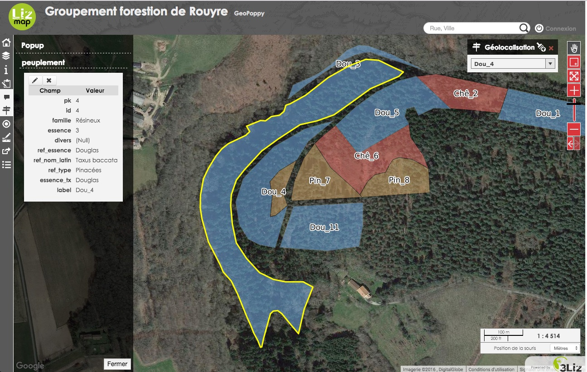

Bienvenue sur la documentation de CartOdroid
============================================
> Attention, il s'agit d'un projet en cours de développement
 

CartOdroid est un outil de consultation et de mise à jour vos données
cartographiques de terrain.  

Ce serveur cartographique portable diffuse vos cartes réalisées sous Qgis
lorsque vous êtes sur le terrain.

A quoi sert CartOdroid? 
-------------------

-   Nous pouvons cartographier, quantifier ou décrire des peuplements forestiers
    d'une propriété de plusieurs centaines d'hectares.

-   Sans couverture réseau internet (Edge, 3G/4G) ni
    éléctrecité sur cette zone nous accédons aux  cartes IGN, Open Street Map et images aériennes aqcuises par drone, avion ou satellite.

-   Nous  utilisons les mêmes cartes que celles disponibles au bureau
    afin de faciliter les mises à jours de données et de former les utilisateurs
    aux mêmes méthodes de saisie.

-   La visualisation et l'intégration des données se fait sur tous types de
    tablettes, smartphones, pc (apple, android, windows, linux) directement
    depuis le navigateur internet sans applications supplémentaires.

-  Les données sont synchronisées vers une base de donnée de sauvegardes quand
    le serveur dispose d'une connexion internet sécurisée.

-   Les stagiaires, techniciens et même les propriétaires forestiers sont autonomes dans la saisie des données en moins de 10 min.

-   L'outil est autonome, petit, léger, simple d'utilisation pour être emmené
    dans la poche ou un sac à dos.

-   Faite des économies avec des licences d'utilisation gratuites et
    OpenSource.
    

Les fonctionnalités
-------------------

### L’authentification

L’administrateur peut restreindre l’accès aux cartes. Pour accéder à ces cartes,
il faut vous s’authentifier.

[Plus de détail dans la documentation de Lizmap](<http://docs.3liz.com/fr/user_guide.html#authentication>)

### Recherche d’adresse
 
La recherche des adresses se fait via les moteurs de recherches suivants : 
 
* Nominatim (OpenStreetMap) 
* Google
* Géoportail

### La localisation par couche

Une fonction de localisation sur vos zones de travaux (lieux, nom de
propriétaire, identifiant de parcelle etc ...)

### La mesure 

La fonction de mesure permet de calculer :

-   une distance

-   une surface

-   un périmètre

### L’impression 

Lizmap permet d'éditer des pdf en fonction de ce qui est affiché dans
l'interface cartographique. Vous pouvez ajouter un titre, du texte. La mise en
page est ajusté en fonction de vos préférences.

### L’édition de données géographiques

L’auteur de la carte peut permettre à des utilisateurs l’édition de certaines
données. Il a aussi la possibilité de limiter les modifications possibles :

-   ajout d’objet

-   modification géométrique

-   modification d’attributs

-   suppression d’objet

 

Les briques techniques
----------------------

### Liste du materiel nécéssaire

-   Serveur miniature (odroid C0/C2)

-   Batteries interne Lipo (3000mAp) pour une autonomie d’environs 4h.

-   Carte micro SD (ou emmc) 16 go pour l’installation du système.

-   Clé Wifi 2 gh

-   Espace de stockage extensible (clés USB 256 Go, disques dures externes)

-   Tablette/smartphone + GPS (intégré ou non)

-   Cable Ethernet

-   Alimentation 2 mAp 5volt

### Logiciels intégrés

Tous les logiciels sont open sources et ne nécéssite pas d'achat de licence.

-   Qgis (+ plugin Lizmap): n’est pas installé sur le serveur mais sur un
    ordinateur de bureau.

-   Postgis.

-   Qgis Serveur.

-   [Lizmap](http://www.3liz.com/lizmap.html) Web Client (interface
    utilisateur).
